 

## 🦾 Now

- 🛠️ Shipping native Apple apps in **Swift** and **SwiftUI**, from menu bar tools to iPhone apps
- 🐦 Living in the **X ecosystem**: analytics tools, algorithm experiments, content generators
- 🌐 Building websites for clients across Switzerland, Germany and Türkiye
- ⚡ Motto: make it work first, polish later (Mark I → Mark XLII)

## ⭐ Most starred

<table>
  <tr>
    <td width="50%" valign="top">
      <a href="https://github.com/Jarvis322/macos-sysdata"><b>🧹 macos-sysdata</b></a> 
      See what is really inside macOS System Data and delete it item by item. A free menu bar app that shows each command before it runs.  
       
    </td>
    <td width="50%" valign="top">
      <a href="https://github.com/Jarvis322/MacWake"><b>⚡ MacWake</b></a> 
      Battery health, charge limit and a Dynamic Island for your Mac. An elegant SwiftUI menu bar app.  
       
    </td>
  </tr>
  <tr>
    <td width="50%" valign="top">
      <a href="https://github.com/Jarvis322/macoscode"><b>🍎 macoscode</b></a> 
      100 power-user tweaks and an interactive terminal TUI/CLI for macOS.  
       
    </td>
    <td width="50%" valign="top">
      <a href="https://github.com/Jarvis322/ZapretMac"><b>🛡️ ZapretMac</b></a> 
      Zapret helper for macOS.  
       
    </td>
  </tr>
</table>

## 📱 Apps

Everything lives at **[yigitech.dev](https://yigitech.dev)** ([Türkçe](https://yigitech.dev/tr)).

<table>
  <tr>
    <td width="50%" valign="top">
      <a href="https://yigitech.dev/apps/haftra"><b>💉 Haftra</b></a> 
      GLP-1 shot tracker for iPhone
    </td>
    <td width="50%" valign="top">
      <a href="https://yigitech.dev/apps/relay"><b>📡 Relay</b></a> 
      Mirror your iPhone screen onto your Tesla's display
    </td>
  </tr>
  <tr>
    <td valign="top">
      <a href="https://yigitech.dev/apps/wake"><b>🔋 Wake</b></a> 
      Battery health, charge limit and a Dynamic Island for your Mac
    </td>
    <td valign="top">
      <a href="https://yigitech.dev/apps/flick"><b>🎬 Flick</b></a> 
      Swipe through films and series to pick tonight's watch
    </td>
  </tr>
  <tr>
    <td valign="top">
      <a href="https://yigitech.dev/apps/dozlu"><b>💊 Dozlu</b></a> 
      Medication reminders that keep every dose on time
    </td>
    <td valign="top">
      <a href="https://yigitech.dev/apps/sifirduman"><b>🚭 Sıfır Duman</b></a> 
      Quit-smoking tracker: smoke-free days and money saved
    </td>
  </tr>
  <tr>
    <td valign="top">
      <a href="https://yigitech.dev/apps/moregb"><b>💾 More GB</b></a> · <i>coming soon</i> 
      Get back the iPhone storage iOS holds as cache
    </td>
    <td valign="top">
      <a href="https://yigitech.dev/apps/netvarlik"><b>🪙 NetVarlık</b></a> · <i>coming soon</i> 
      Your net worth in Turkish lira
    </td>
  </tr>
</table>

## 🧰 Arsenal

## 📊 Telemetry

<picture>
  <source media="(prefers-color-scheme: dark)" srcset="https://github-readme-stats.vercel.app/api?username=Jarvis322&show_icons=true&hide_border=true&theme=transparent&title_color=f0a500&icon_color=e62429&text_color=e6e6e6&count_private=true" />
  
</picture>
<picture>
  <source media="(prefers-color-scheme: dark)" srcset="https://github-readme-stats.vercel.app/api/top-langs/?username=Jarvis322&layout=compact&hide_border=true&theme=transparent&title_color=f0a500&text_color=e6e6e6&langs_count=8" />
  
</picture>

 

<picture>
  <source media="(prefers-color-scheme: dark)" srcset="https://streak-stats.demolab.com/?user=Jarvis322&hide_border=true&background=00000000&ring=f0a500&fire=e62429&currStreakLabel=f0a500&currStreakNum=e6e6e6&sideNums=e6e6e6&sideLabels=b3b3b3&dates=808080" />
  
</picture>

## 🌍 Websites I built

[Helvetia Limousine](https://helvetialimousine.ch) · [WeDent Clinics](https://wedentclinics.com) · [Hepsiparfum](https://hepsiparfum.com) · [Oscar Education](https://oscareducation.com) · [TeenEagle](https://teeneagle.org) · [Kariyer Destek](https://kariyerdestek.de/) · [ÇANKAYAPI](https://cankayapi.com) · [Informasive](https://informasive.com) · [Drvia](https://drvia.com.tr/) · [buraktatli.com](https://buraktatli.com) · [VizeBelge](https://vizebelge.com/) · [Summer Work Germany](https://summerworkgermany.vercel.app/)

 

<i>"Sometimes you gotta run before you can walk."</i>

